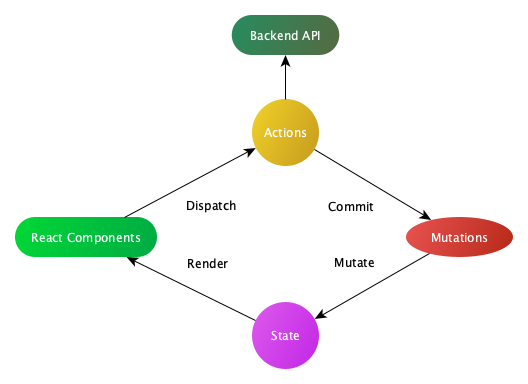

# redux-sam

> `redux-sam` 作为一个 Redux 中间件，让你像使用Vuex一样管理状态。

笔者是一位 Vue 患者，希望像 Vuex 一样简单而纯粹地管理状态，而不是像 Dva 一样在 `redux-saga` 上进行二次封装。因此，在借(chao)鉴(xi) Vuex 源码之后，衍生出了一个 Redux 中间件 `redux-sam`。

以下是一个表示“单向数据流”理念的简单示意：


每一个 redux-sam 应用的核心就是 store（仓库）。“store”基本上就是一个容器，它包含着你的应用中大部分的状态 (state)，你不能直接改变 store 中的状态。改变 store 中的状态的唯一途径就是显式地提交 (commit) mutation，这样使得我们可以方便地跟踪每一个状态的变化，从而让我们能够实现一些工具帮助我们更好地了解我们的应用。

## 最简单的 Store

安装 redux-sam 之后，让我们来创建一个 store。创建过程直截了当——仅需要提供一个初始 state 对象和一些 mutation：

```js
import { createStore } from 'redux-sam';
import { Component } from 'react';
import createLogger from 'redux-sam/logger';

const { store, sam } = createStore({
  state,
  actions,
  mutations,
  plugins: [process.env.NODE_ENV !== 'production' && createLogger()]
}, Component);

export { store, sam };

```

现在，你可以通过 `sam.state` or `store.getState()` 来获取状态对象，以及通过 store.dispatch 方法触发状态变更：

```js
sam.commit('increment')
console.log(sam.state.count) // -> 1

```

或者

```js
store.dispatch('increment')
console.log(store.getState().count) // -> 1

```

再次强调，我们通过提交 mutation 的方式，而非直接改变 store.getState().count，是因为我们想要更明确地追踪到状态的变化。这个简单的约定能够让你的意图更加明显，这样你在阅读代码的时候能更容易地解读应用内部的状态改变。此外，这样也让我们有机会去实现一些能记录每次状态改变，保存状态快照的调试工具。有了它，我们甚至可以实现如时间穿梭般的调试体验。
